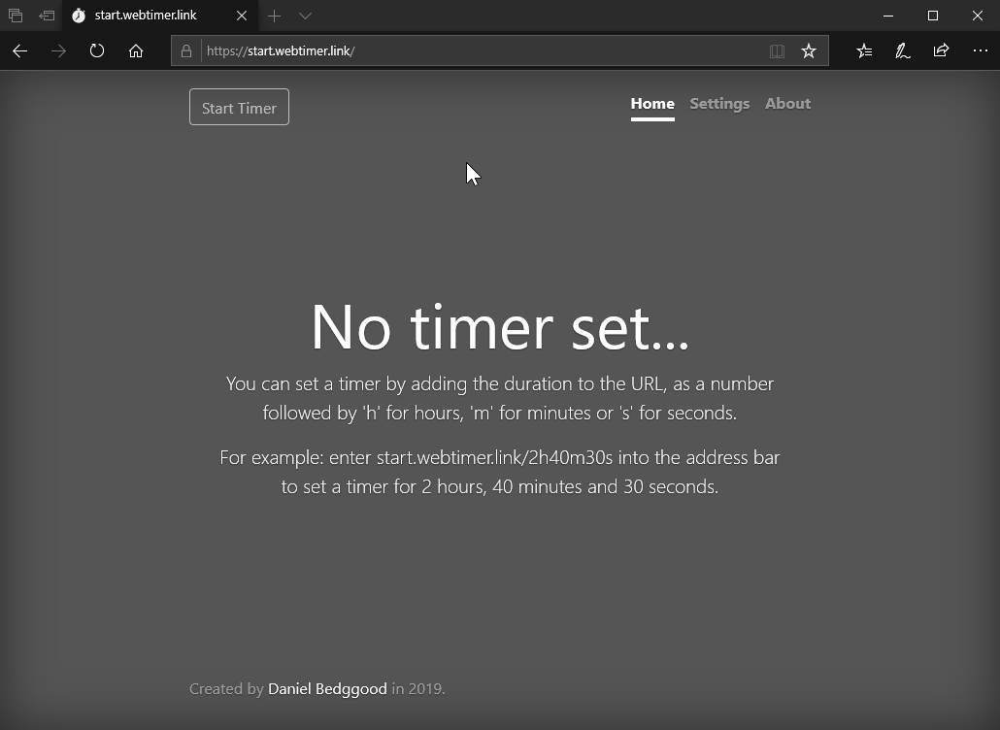

# webtimer 

A minimalistic fullscreen browser-based timer.

The timer is set by filling in the url path with the desired duration, allowing easy to bookmarking and sharing.

Made with Express and the Pug template engine, hosted on Heroku.

## Demo
